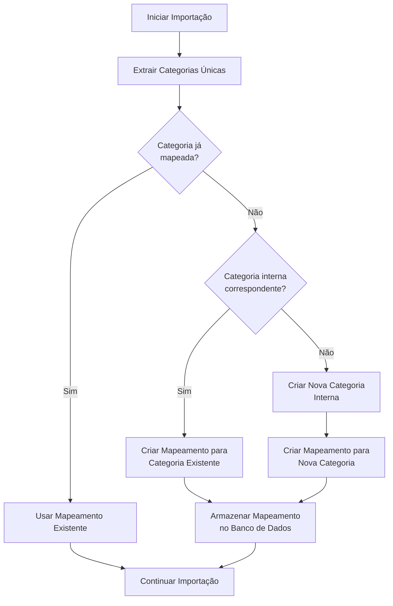

# Sistema de Mapeamento Dinâmico de Categorias

## Visão Geral

O sistema de mapeamento dinâmico de categorias foi implementado para resolver a necessidade de uma abordagem mais flexível e escalável para importar categorias de transações de sistemas externos, como o Gestão Click, para as categorias internas do Conta Rápida.

## Problema Anterior

Anteriormente, as categorias do Gestão Click eram mapeadas para o enum `TransactionCategory` utilizando uma abordagem estática:

1. As categorias eram mapeadas através de um método no código (`mapCategoryToEnum`)
2. Limitações de um enum fixo restringiam novas categorias sem alteração do código
3. Não havia como personalizar o mapeamento para atender necessidades específicas de cada usuário
4. Muitas categorias acabavam sendo mapeadas para "OTHER" por falta de correspondência

## Nova Solução

O novo sistema utiliza a tabela `CategoryMapping` no banco de dados para criar uma relação dinâmica entre categorias externas e internas:

### Vantagens

1. **Flexibilidade**: Mapeamentos podem ser criados em tempo de execução
2. **Personalização**: Usuários podem definir seus próprios mapeamentos
3. **Persistência**: Todas as categorias encontradas são armazenadas e reutilizadas
4. **Priorização**: Mapeamentos podem ter diferentes níveis de prioridade
5. **Rastreabilidade**: A categoria original é preservada nos metadados

## Componentes do Sistema

### 1. Tabela CategoryMapping

A tabela `CategoryMapping` no banco de dados armazena os mapeamentos:

```prisma
model CategoryMapping {
  id               String   @id @default(cuid())
  userId           String
  externalCategory String   // Categoria do sistema externo (ex: Gestão Click)
  internalCategory String   // ID ou valor do enum da categoria interna
  source           String   @default("GESTAO_CLICK") // Fonte do dado externo
  priority         Int      @default(50) // Prioridade do mapeamento (0-100)
  active           Boolean  @default(true) // Se o mapeamento está ativo
  createdAt        DateTime @default(now())
  updatedAt        DateTime @updatedAt

  user User @relation(fields: [userId], references: [id], onDelete: Cascade)

  @@index([userId, source])
  @@unique([userId, externalCategory, source])
}
```

### 2. Método de Importação de Categorias

O método `importCategories` foi modificado para:

1. Extrair categorias únicas das transações a serem importadas
2. Verificar mapeamentos existentes para cada categoria
3. Criar mapeamentos automaticamente para categorias ainda não mapeadas
4. Criar categorias internas personalizadas quando necessário

### 3. Método de Consulta de Mapeamento

O novo método `getCategoryMappingForTransaction` busca o mapeamento adequado para uma categoria:

1. Busca por correspondência exata primeiro
2. Se não encontrar, busca por correspondência parcial
3. Utiliza heurísticas para selecionar a melhor categoria interna
4. Retorna "OTHER" como fallback se nenhuma correspondência for encontrada

## Fluxo de Trabalho

### Importação de Categorias



### Aplicação do Mapeamento

Quando uma transação é importada:

1. A categoria externa é identificada
2. O sistema busca o mapeamento correspondente no banco de dados
3. A transação é criada com a categoria interna mapeada
4. A categoria original é preservada nos metadados da transação

## Implementação no Código

### 1. Importação de Categorias

```typescript
private async importCategories(transactions: GestaoClickTransaction[], userId: string): Promise<void> {
  // Extrair categorias únicas
  const uniqueCategories = new Set<string>();
  transactions.forEach(tx => {
    if (tx.categoria && tx.categoria.trim() !== '') {
      uniqueCategories.add(tx.categoria.trim());
    }
  });

  // Verificar mapeamentos existentes
  const existingMappings = await prisma.categoryMapping.findMany({
    where: { userId, source: "GESTAO_CLICK" }
  });

  // Filtrar apenas categorias não mapeadas
  const newCategories = Array.from(uniqueCategories).filter(
    cat => !existingMappings.find(m => 
      m.externalCategory.toLowerCase() === cat.toLowerCase()
    )
  );

  // Criar mapeamentos para novas categorias
  if (newCategories.length > 0) {
    // Implementação da criação de mapeamentos
    // ...
  }
}
```

### 2. Consulta de Mapeamento

```typescript
private async getCategoryMappingForTransaction(userId: string, externalCategory: string): Promise<TransactionCategory> {
  // Buscar mapeamento existente
  const mapping = await prisma.categoryMapping.findFirst({
    where: {
      userId,
      externalCategory: { equals: externalCategory, mode: 'insensitive' },
      active: true
    },
    orderBy: { priority: 'desc' }
  });

  if (mapping) {
    return mapping.internalCategory as TransactionCategory;
  }
  
  // Lógica de fallback
  // ...
  
  return 'OTHER';
}
```

## Gestão de Mapeamentos

### Criação Automática

O sistema cria mapeamentos automaticamente durante a importação de transações:

1. Categorias externas desconhecidas são detectadas
2. O sistema tenta encontrar a melhor categoria interna correspondente
3. Um novo mapeamento é criado e armazenado para uso futuro

### Personalização Manual (Planejada)

Está prevista uma interface para que os usuários possam:

1. Visualizar todos os mapeamentos existentes
2. Modificar mapeamentos existentes
3. Criar novos mapeamentos manualmente
4. Desativar mapeamentos indesejados
5. Ajustar prioridades de mapeamentos

## Próximos Passos

1. **Interface de Usuário**: Desenvolver uma interface para gerenciar mapeamentos
2. **Regras Avançadas**: Implementar regras mais sofisticadas para mapeamento automático
3. **Aprendizado de Máquina**: Utilizar técnicas de ML para melhorar a precisão dos mapeamentos
4. **Estatísticas**: Gerar relatórios sobre uso de categorias e eficácia dos mapeamentos
5. **Importação/Exportação**: Permitir compartilhar mapeamentos entre usuários 